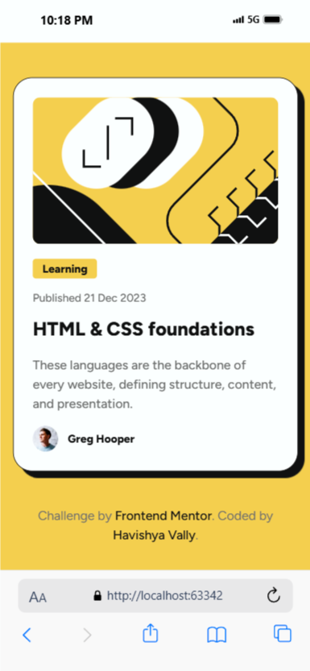

# Frontend Mentor - Blog preview card solution

This is a solution to the [Blog preview card challenge on Frontend Mentor](https://www.frontendmentor.io/challenges/blog-preview-card-ckPaj01IcS). 

## Table of contents

- [Overview](#overview)
    - [Screenshot](#screenshot)
    - [Links](#links)
- [My process](#my-process)
    - [Built with](#built-with)
    - [What I learned](#what-i-learned)
    - [Useful resources](#useful-resources)
- [Author](#author)

## Overview

### Screenshot

### Links

- Solution URL: [Add solution URL here](https://your-solution-url.com)
- Live Site URL: [Add live site URL here](https://your-live-site-url.com)

## My process

### Built with

- Semantic HTML5 markup
- CSS custom properties
- Flexbox
- Mobile-first design

### What I learned

During this project, I gained significant experience with semantic HTML, which was one of my main learning objectives. Specifically, I learned:

1. **Semantic HTML Structure:**
- Proper usage of `<article>` for self-contained content
- Using `<header>` and `<footer>` elements appropriately
- Implementing `<figure>` for image content
- Utilizing `<time>` element for dates

2. **Accessibility Benefits:**
- Understanding how semantic elements improve screen reader compatibility
- Learning the importance of proper document structure
- Implementing meaningful HTML that describes its content

3. **Other Key Learnings:**
- Used CSS Variables for consistent theming
- Created responsive layouts with Flexbox
- Implemented proper spacing and typography

## Font Information

This project uses the Figtree font family, which includes:
- Variable font support
- Multiple weights (Light to Black)
- Italic variants
- Regular and medium styles

Font files included:
- Variable fonts:
    - Figtree-VariableFont_wght.ttf
    - Figtree-Italic-VariableFont_wght.ttf
- Static fonts from Light to Black (including italic variants)

## Author

- Frontend Mentor - [@HavishyaVally](https://www.frontendmentor.io/profile/HavishyaVally)
- GitHub - [HavishyaVally](https://github.com/havishya10)

---

Note: This project is a solution to a Frontend Mentor challenge and demonstrates implementation of modern CSS features and responsive design principles.