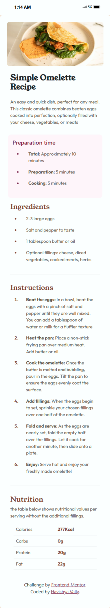
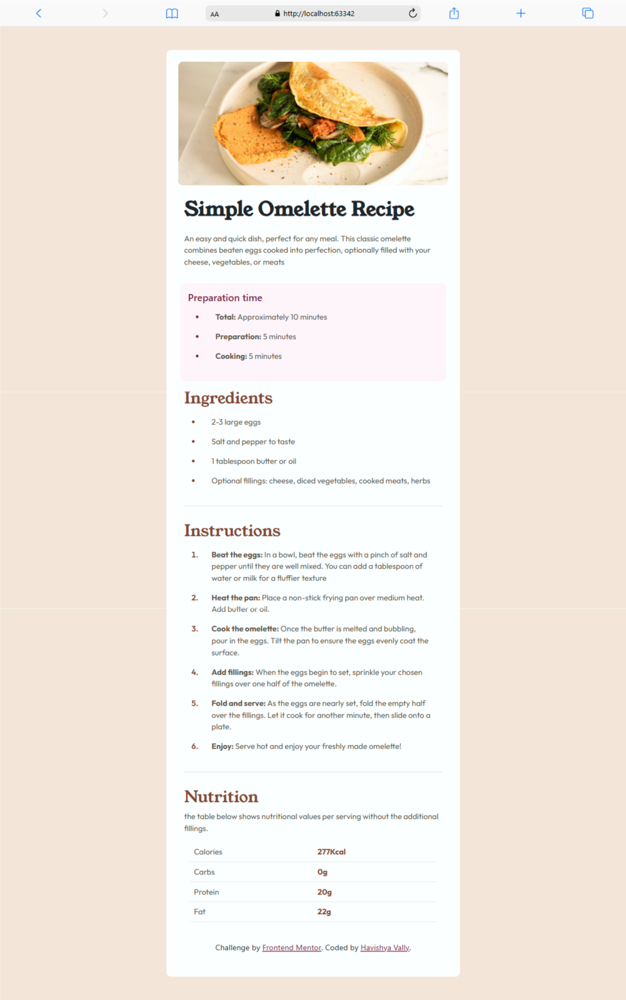

# Frontend Mentor - Recipe page solution #

This is a solution to the [Recipe page challenge on Frontend Mentor](https://www.frontendmentor.io/challenges/recipe-page-KiTsR8QQKm).

## Table of contents

- [Overview](#overview)
    - [Screenshots](#screenshot)
    - [Demo Links](#links)
- [My process](#my-process)
    - [Built with](#built-with)
    - [What I learned](#what-i-learned)
    - [Useful resources](#useful-resources)
- [Author](#author)

## Overview

### Screenshot

### Links

- Solution URL: [Add solution URL here](https://your-solution-url.com)
- Live Site URL: [Add live site URL here](https://your-live-site-url.com)

## My process

### Built with

- Semantic HTML5 markup
- CSS custom properties
- Bootstrap
- Mobile-first workflow

### What I learned

Learned Bootstrap Grid System

### Useful resources

- [Bootstrap](https://getbootstrap.com/docs/5.3/getting-started/introduction/) - The documentation was easy to follow and much better than any tutorials out there.

## Author

- Website - [Add your name here](https://www.your-site.com)
- Frontend Mentor - [@yourusername](https://www.frontendmentor.io/profile/yourusername)
- Twitter - [@yourusername](https://www.twitter.com/yourusername)

