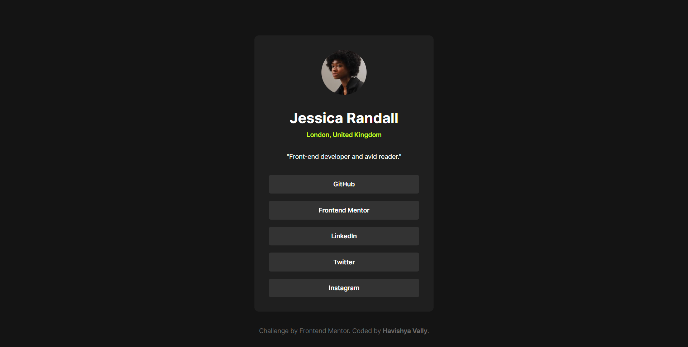

# Frontend Mentor - Social links profile solution

This is a solution to the [Social links profile challenge on Frontend Mentor](https://www.frontendmentor.io/challenges/social-links-profile-UG32l9m6dQ).

## Table of contents

- [Overview](#overview)
  - [The challenge](#the-challenge)
  - [Screenshot](#screenshot)
  - [Links](#links)
- [Built with](#built-with)
- [Author](#author)

## Overview

### The challenge

Users should be able to:

- See hover and focus states for all interactive elements on the page

### Screenshot

### Links

- Solution URL: (https://github.com/havishya10/Frontend-Mentor/edit/main/social-links-profile/)
- Live Site URL: (https://social-links-fm1.netlify.app)

## My process

### Built with

- Semantic HTML5 markup
- CSS custom properties
- Flexbox
- CSS Grid
- Mobile-first workflow

## Author

- Frontend Mentor - [@havishya10](https://www.frontendmentor.io/profile/havishya10)
- Twitter - [@havishyavally](https://x.com/HavishyaVally)
- LinkedIn - [Havishya Vally Sunkara](https://www.linkedin.com/in/havishyavally/)
